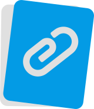

# Permanent Clipboard

Permanent Clipboard is Google Chrome&trade; browser extension that improves the clipboard by allowing users to store multiple entries just a click away.

Do you want quick access your response templates? Or maybe you often fill forms that aren't standard and the browser doesn't support it? Then Permanent Clipboard is the extension for you.

### Main features

##### Directories

For convenience, entries can be categorized in directories for logical structure, so you won't mix business with pleasure.
Directories can also be nested so the structure you create can reflect any complicated work flow you face each day.

##### Cross computers synchronization

Permanent Clipboard can synchronize between your Google Chrome&trade; instances, as long as you are logged in into your Google Account.
But this feature is not obligatory, and you can easy opt out from it if you store confidential information in your clipboard.

##### Backups

When you are not using synchronized storage it is important not to lose your work, this is why Permanent Clipboard lets you create a backup of all your entries and restore then at any point, so you are safe from any data loss.

### Help 

Permanent Clipboard is free and open source software and I would like to keep it that way. So if you enjoy the
extension I would appreciate if you help me reach wider audience by rating the extension on [Chrome Web Store](https://chrome.google.com/webstore/detail/permanent-clipboard/hilkjcfodmbdgpadbpehimibheopoccb) or telling your friends about it.

You can also support the growth of Permanent Clipboard by donating via PayPal. Donations allows me to spend more time developing the extension, fixing bugs, adding features and improving the extension overall.

